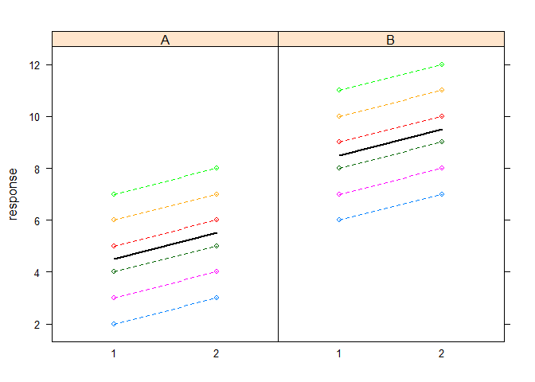

Background
----------

I came across an interesting question with the topic of [“Condition
layer across panels in
lattice”](http://stackoverflow.com/questions/35353923/condition-layer-across-panels-in-lattice/35476469#35476469)
asked recently on StackOverflow. The questioner was trying to add line
segments from an auxiliary dataset to a **lattice** `stripplot` using
`layer` from **latticeExtra**, but failed since the group-specific
vertical lines were displayed in each of the sub-panels, i.e. regardless
of the particular group.

It made me think about how I would tackle this issue and I finally came
up with two different solutions on how to prevent the conditional line
segments from being drawn in each of the sub-panels. But first of all,
here is the sample data.

    ## load packages
    library(latticeExtra)

    ## Loading required package: lattice

    ## create sample data
    raw_data = data.frame(subject = rep(1:6, 4),
                           cond1 = as.factor(rep(1:2, each = 12)),
                           cond2 = rep(rep(c("A", "B"), each = 6), 2),
                           response = c(2:7, 6:11, 3:8, 7:12))

    ## create auxiliary data
    summary_data =
      data.frame(cond1 = as.factor(rep(1:2, each = 2)),
                 cond2 = rep(c("A", "B"), times = 2),
                 mean = aggregate(response ~ cond2 * cond1, raw_data, mean)$response,
                 within_ci = c(0.57, 0.54, 0.6, 0.63))

    summary_data$lci = summary_data$mean - summary_data$within_ci
    summary_data$uci = summary_data$mean + summary_data$within_ci

    ## create stripplot
    p_strip = stripplot(response ~ cond1 | cond2, groups = subject,
                         data = raw_data, panel = function(x, y, ...) {
                           panel.stripplot(x, y, type = "b", lty = 2, ...)
                           panel.average(x, y, fun = mean, lwd = 2,
                                         col = "black", ...)
                         })

    print(p_strip)

Approach \#1: manual segment insertion via trellis.focus
--------------------------------------------------------

Now, my first solution was to print the stripplot (e.g., inside a png or
any other graphics device) and subsequently modify each sub-panel using
`trellis.focus`.

    ## display stripplot
    print(p_strip)

    ## loop over grops
    for (i in c("A", "B")) {

      # subset of current group
      dat = subset(summary_data, cond2 == i)

      # add intervals to current panel
      trellis.focus(name = "panel", column = ifelse(i == "A", 1, 2), row = 1)
      panel.segments(x0 = dat$cond1, y0 = dat$lci,
                     x1 = dat$cond1, y1 = dat$uci, subscripts = TRUE)
      trellis.unfocus()
    }

Approach \#2: conditional segments via panel.number
---------------------------------------------------

Although this approach is quite straightforward, it has a big
disadvantage: the created plot cannot be stores in a variable which
excludes its use for subsequent processing inside R. Therefore, I came
up with another (possibly more convenient) solution and created a
separate xyplot where the group-specific lower and upper y-values (y0,
y1 passed on to panel.segments) were set manually in dependence of the
current panel.number. The two separate plots were subsequently blended
together using as.layer from **latticeExtra**. In contrast to the first
approach using `trellis.focus`, the thus created plot can be stored in a
variable and is hence available for subsequent processing inside R.

    p_seg = xyplot(lci ~ cond1 | cond2, data = summary_data, ylim = c(1, 13),
           panel = function(...) {
             # lower and upper y values
             y0 = list(summary_data$lci[c(1, 3)], summary_data$lci[c(2, 4)])
             y1 = list(summary_data$uci[c(1, 3)], summary_data$uci[c(2, 4)])
             # insert vertical lines depending on current panel
             panel.segments(x0 = 1:2, x1 = 1:2,
                            y0 = y0[[panel.number()]],
                            y1 = y1[[panel.number()]])
           })

    p_comb = p_strip +
      as.layer(p_seg)

    print(p_comb)

