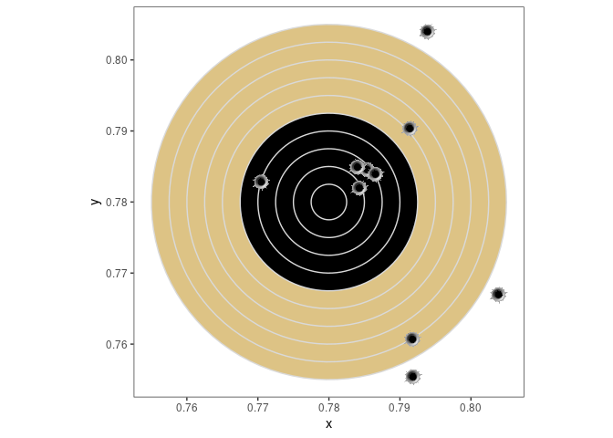

    library(ggimage)

    # credits for `circleFun()` go to
    # * https://stackoverflow.com/a/6863490
    # * https://stackoverflow.com/a/19296181
    # 
    # bullet hole is licensed under the creative commons license and available at
    # https://www.vhv.rs/viewpic/hTJRihb_bullet-png-free-image-download-bullet-hole-transparent/

    circleFun = function(
        center = c(0, 0)
        , diameter = 1
        , npoints = 100
    ) {
      r = diameter / 2
      tt = seq(0, 2*pi, length.out = npoints)
      xx = center[1] + r * cos(tt)
      yy = center[2] + r * sin(tt)
      return(data.frame(x = xx, y = yy))
    }

    ## create circles with decrementing diameter
    diameters = seq(0.05, 0.005, -0.005)

    circles = Map(
      \(i) {
        circleFun(
          c(0.78, 0.78)
          , diameter = i
          , npoints = 100
        )
      }
      , diameters
    ) |> 
      data.table::rbindlist(
        idcol = "ring"
      )

    ## specify ring colors
    colors = rep(
      c("#ddc385", "black")
      , each = 5L
    )
    names(colors) = as.character(1:10)

    ## create target plot
    p0 = ggplot(
      circles
      , aes(x, y, fill = factor(ring))
    ) + 
      geom_polygon(
        color = "grey85"
        , show.legend = FALSE
      ) + 
      scale_fill_manual(
        values = colors
      ) + 
      coord_fixed() + 
      theme_bw() + 
      theme(
        panel.grid = element_blank()
      )

    ## add some bullet holes
    set.seed(1899L)

    dat = matrix(
      runif(
        20L
        , min = 0.78 - 0.025
        , max = 0.78 + 0.025
      )
      , ncol = 2L
      , dimnames = list(NULL, c("x", "y"))
    )

    dat = data.frame(
      dat
      , image = "inst/extdata/bullet_hole.png"
    )

    p0 + 
      geom_image(
        aes(
          x = x
          , y = y
          , image = image
        )
        , data = dat
        , inherit.aes = FALSE
      )

### ZZ. Final things last

Session info (click to view)

    devtools::session_info()

    ## ─ Session info ───────────────────────────────────────────────────────────────
    ##  setting  value
    ##  version  R version 4.1.3 (2022-03-10)
    ##  os       Ubuntu 20.04.4 LTS
    ##  system   x86_64, linux-gnu
    ##  ui       X11
    ##  language (EN)
    ##  collate  en_US.UTF-8
    ##  ctype    en_US.UTF-8
    ##  tz       Europe/Berlin
    ##  date     2022-04-22
    ##  pandoc   2.17.1.1 @ /usr/lib/rstudio/bin/quarto/bin/ (via rmarkdown)
    ## 
    ## ─ Packages ───────────────────────────────────────────────────────────────────
    ##  package      * version date (UTC) lib source
    ##  brio           1.1.3   2021-11-30 [1] CRAN (R 4.1.2)
    ##  cachem         1.0.6   2021-08-19 [1] CRAN (R 4.1.1)
    ##  callr          3.7.0   2021-04-20 [1] CRAN (R 4.1.0)
    ##  cli            3.2.0   2022-02-14 [1] CRAN (R 4.1.2)
    ##  colorspace     2.0-3   2022-02-21 [1] CRAN (R 4.1.2)
    ##  crayon         1.5.1   2022-03-26 [1] CRAN (R 4.1.3)
    ##  data.table     1.14.2  2021-09-27 [1] CRAN (R 4.1.2)
    ##  desc           1.4.1   2022-03-06 [1] CRAN (R 4.1.2)
    ##  devtools       2.4.3   2021-11-30 [1] CRAN (R 4.1.2)
    ##  digest         0.6.29  2021-12-01 [1] CRAN (R 4.1.2)
    ##  dplyr          1.0.8   2022-02-08 [1] CRAN (R 4.1.2)
    ##  ellipsis       0.3.2   2021-04-29 [1] CRAN (R 4.1.0)
    ##  evaluate       0.15    2022-02-18 [1] CRAN (R 4.1.2)
    ##  fansi          1.0.3   2022-03-24 [1] CRAN (R 4.1.3)
    ##  farver         2.1.0   2021-02-28 [1] CRAN (R 4.1.0)
    ##  fastmap        1.1.0   2021-01-25 [1] CRAN (R 4.1.0)
    ##  fs             1.5.2   2021-12-08 [1] CRAN (R 4.1.2)
    ##  generics       0.1.2   2022-01-31 [1] CRAN (R 4.1.2)
    ##  ggfun          0.0.6   2022-04-01 [1] CRAN (R 4.1.3)
    ##  ggimage      * 0.3.0   2021-09-29 [1] CRAN (R 4.1.3)
    ##  ggplot2      * 3.3.5   2021-06-25 [1] CRAN (R 4.1.0)
    ##  ggplotify      0.1.0   2021-09-02 [1] CRAN (R 4.1.1)
    ##  glue           1.6.2   2022-02-24 [1] CRAN (R 4.1.2)
    ##  gridGraphics   0.5-1   2020-12-13 [1] CRAN (R 4.1.0)
    ##  gtable         0.3.0   2019-03-25 [1] CRAN (R 4.1.0)
    ##  highr          0.9     2021-04-16 [1] CRAN (R 4.1.0)
    ##  htmltools      0.5.2   2021-08-25 [1] CRAN (R 4.1.1)
    ##  jsonlite       1.8.0   2022-02-22 [1] CRAN (R 4.1.2)
    ##  knitr          1.38    2022-03-25 [1] CRAN (R 4.1.3)
    ##  labeling       0.4.2   2020-10-20 [1] CRAN (R 4.1.0)
    ##  lifecycle      1.0.1   2021-09-24 [1] CRAN (R 4.1.1)
    ##  magick         2.7.3   2021-08-18 [1] CRAN (R 4.1.3)
    ##  magrittr       2.0.3   2022-03-30 [1] CRAN (R 4.1.3)
    ##  memoise        2.0.1   2021-11-26 [1] CRAN (R 4.1.2)
    ##  munsell        0.5.0   2018-06-12 [1] CRAN (R 4.1.0)
    ##  pillar         1.7.0   2022-02-01 [1] CRAN (R 4.1.2)
    ##  pkgbuild       1.3.1   2021-12-20 [1] CRAN (R 4.1.2)
    ##  pkgconfig      2.0.3   2019-09-22 [1] CRAN (R 4.1.0)
    ##  pkgload        1.2.4   2021-11-30 [1] CRAN (R 4.1.2)
    ##  prettyunits    1.1.1   2020-01-24 [1] CRAN (R 4.1.0)
    ##  processx       3.5.3   2022-03-25 [1] CRAN (R 4.1.3)
    ##  prompt         1.0.1   2021-03-12 [1] CRAN (R 4.1.0)
    ##  ps             1.6.0   2021-02-28 [1] CRAN (R 4.1.0)
    ##  purrr          0.3.4   2020-04-17 [1] CRAN (R 4.1.0)
    ##  R6             2.5.1   2021-08-19 [1] CRAN (R 4.1.1)
    ##  Rcpp           1.0.8.3 2022-03-17 [1] CRAN (R 4.1.3)
    ##  remotes        2.4.2   2021-11-30 [1] CRAN (R 4.1.2)
    ##  rlang          1.0.2   2022-03-04 [1] CRAN (R 4.1.2)
    ##  rmarkdown      2.13    2022-03-10 [1] CRAN (R 4.1.2)
    ##  rprojroot      2.0.3   2022-04-02 [1] CRAN (R 4.1.3)
    ##  rstudioapi     0.13    2020-11-12 [1] RSPM (R 4.1.0)
    ##  scales         1.2.0   2022-04-13 [1] CRAN (R 4.1.3)
    ##  sessioninfo    1.2.2   2021-12-06 [1] CRAN (R 4.1.2)
    ##  stringi        1.7.6   2021-11-29 [1] CRAN (R 4.1.2)
    ##  stringr        1.4.0   2019-02-10 [1] CRAN (R 4.1.0)
    ##  testthat       3.1.3   2022-03-29 [1] CRAN (R 4.1.3)
    ##  tibble         3.1.6   2021-11-07 [1] CRAN (R 4.1.2)
    ##  tidyselect     1.1.2   2022-02-21 [1] CRAN (R 4.1.2)
    ##  usethis        2.1.5   2021-12-09 [1] CRAN (R 4.1.2)
    ##  utf8           1.2.2   2021-07-24 [1] CRAN (R 4.1.0)
    ##  vctrs          0.4.1   2022-04-13 [1] CRAN (R 4.1.3)
    ##  withr          2.5.0   2022-03-03 [1] CRAN (R 4.1.2)
    ##  xfun           0.30    2022-03-02 [1] CRAN (R 4.1.2)
    ##  yaml           2.3.5   2022-02-21 [1] CRAN (R 4.1.2)
    ##  yulab.utils    0.0.4   2021-10-09 [1] CRAN (R 4.1.1)
    ## 
    ##  [1] /home/fdetsch/R/x86_64-pc-linux-gnu-library/4.1
    ##  [2] /usr/local/lib/R/site-library
    ##  [3] /usr/lib/R/site-library
    ##  [4] /usr/lib/R/library
    ## 
    ## ──────────────────────────────────────────────────────────────────────────────

